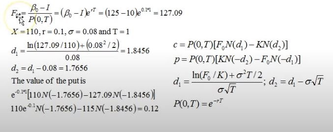

# Black 1976 coupon bond pricing implementation
A financial suite of applications, currently includes Black 1976 coupon bond pricing 

Special thanks to Brian Bryne from the University of Dublin on his excellent video regarding the initial C++ implementation.

 

The highlighted formula is the one applied in the code. 

Todo: javadocs, unit test, implement hull & white, insurance calculator, mortgage repayment calculator

